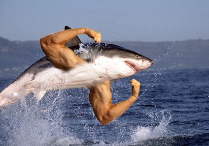

<!DOCTYPE html>
<html lang="en">
<head>
    <!-- Required meta tags always come first -->
    <meta charset="utf-8">
    <meta name="viewport" content="width=device-width, initial-scale=1, shrink-to-fit=no">
    <meta http-equiv="x-ua-compatible" content="ie=edge">

    <title>MJS Portfolio</title>

    <link rel="stylesheet" href="normalize.css" />
    <!-- Bootstrap CSS -->
    <link rel="stylesheet" href="https://stackpath.bootstrapcdn.com/bootstrap/4.4.1/css/bootstrap.min.css" integrity="sha384-Vkoo8x4CGsO3+Hhxv8T/Q5PaXtkKtu6ug5TOeNV6gBiFeWPGFN9MuhOf23Q9Ifjh" crossorigin="anonymous">
    <link rel="stylesheet" href="style.css" />
</head>
<body id="home" data-spy="scroll" data-target=".navbar" data-offset="100">
    <header>
        <nav class="navbar navbar-dark bg-dark navbar-fixed-top">
            <button class="navbar-toggler" type="button" data-toggle="collapse" data-target="#exCollapsingNavbar2">
                &#9776;
            </button>
            

                <ul class="nav navbar-nav">
                    <li class="nav-item">
                        <a class="nav-link" href="#home">Home</a>
                    </li>
                    <li class="nav-item">
                        <a class="nav-link" href="#about">About</a>
                    </li>
                    <li class="nav-item">
                        <a class="nav-link" href="#webpages">Webpages</a>
                    </li>
                    <li class="nav-item">
                        <a class="nav-link" href="#graphics">Artwork</a>
                    </li>

                    <li class="nav-item">
                        <a class="nav-link" href="#music">Music</a>
                    </li>

                </ul>
            

        </nav>

        

            <svg class="text-center" version="1.1" id="Layer_1" xmlns="http://www.w3.org/2000/svg" xmlns:xlink="http://www.w3.org/1999/xlink" x="0px" y="0px"
                 width="450px" height="40px" viewBox="0 0 450 40" style="enable-background:new 0 0 450 40;" xml:space="preserve">
            <!---->
            <g>
            <path class="logo" class="st0" d="M8.2,14.3L5.8,26.4c-0.3,1.6-0.5,2.8-0.5,3.7c0,0.9,0.4,1.6,1.2,2.2c-1.3,0.4-2.4,0.6-3.1,0.6
      c-1.3,0-1.9-0.5-1.9-1.5c0-1.1,0.4-3.1,1.1-6L6.7,9.7L5.9,7.4C5.1,4.8,4.2,3.2,3.4,2.6c1.2-0.7,2.2-1.1,3.1-1.1
      c0.7,0,1.3,0.5,1.7,1.6s1.4,3.8,2.7,8.1c0.3,0.9,0.5,1.6,0.6,2.1l0.3,0.9c1.9,5.4,3.5,8.2,4.9,8.2c1.5,0,3.6-2.2,6.3-6.6
      c2.7-4.4,4.2-8,4.4-10.9c1.4-0.5,2.4-0.7,3-0.7c1.2,0,1.8,0.7,1.8,2c0,0.4-0.1,1.7-0.4,3.7c-0.3,1.8-0.5,3.3-0.6,4.4l-1.3,12
      c-0.1,0.8-0.1,1.7-0.1,2.5c0,2.4,0.5,4,1.5,4.6c-1.3,0.9-2.3,1.3-3.2,1.3c-1.5,0-2.2-1.5-2.2-4.6c0-1.2,0.1-2.7,0.3-4.5l1.6-15.2
      c-1.5,4.4-3.3,8.1-5.7,11.2c-2.3,3.1-4.4,4.6-6.2,4.6c-1.4,0-2.8-1.1-4.2-3.2C10.4,21,9.2,18,8.2,14.3z" />

            <path class="logo" class="st0" d="M52.9,20.9c-1.6,3.3-3.5,6-5.8,8.3c-2.3,2.3-4.3,3.4-6,3.4c-1.3,0-2.3-0.6-3.1-1.7c-0.8-1.2-1.2-2.7-1.2-4.6
      c0-3.8,1.2-7.2,3.5-10.2c2.3-2.9,5-4.4,8.1-4.4c1.9,0,3.9,0.6,6,1.7c0.3-1.1,1.6-1.7,3.9-1.7c0.1,0,0.4,0,0.7,0
      c-0.7,1.1-1.2,2.5-1.6,4.4l-0.3,1.6c-0.4,1.7-0.5,3.8-0.5,6.1c0,2.7,0.6,4,1.9,4c1.3,0,3.1-1.1,5.4-3.3s4.6-5,6.8-8.5l1.4,1
      c-2.3,4.1-4.9,7.4-7.8,10.1c-2.9,2.7-5.4,4.1-7.5,4.1c-2.7,0-4-2.2-4-6.6C52.8,23.7,52.8,22.5,52.9,20.9z M53.8,16.5
      c-2.6-1.7-4.7-2.5-6.4-2.5c-1.9,0-3.5,1.1-4.8,3.4c-1.4,2.3-2,4.9-2,8c0,2.5,0.8,3.7,2.4,3.7c1.8,0,5.1-3.9,10.1-11.6
      C53.1,17.4,53.3,17.1,53.8,16.5z" />

            <path class="logo" class="st0" d="M71.5,32c-0.8,0.4-1.5,0.6-2,0.6c-1.3,0-1.9-0.6-1.9-1.7c0-0.6,0.2-2,0.7-4.2l0.9-4.6c0.6-2.7,0.8-4.7,0.8-6.1
      c0-0.7-0.2-1.3-0.6-1.8c1.3-0.4,2.3-0.7,3.2-0.7c0.9,0,1.3,0.5,1.3,1.6c0,0.7-0.3,2.5-0.9,5.3l-1,5.4c2.3-4.5,4.7-8,7-10.5
      c2.4-2.5,4.5-3.8,6.4-3.8c0.7,0,1.3,0.2,1.7,0.6s0.7,0.9,0.7,1.4c0,0.9-0.9,2-2.8,3.4c-0.5-1-1.1-1.5-2-1.5c-1.6,0-3.5,1.7-6,5
      c-1.5,2.1-2.8,4.2-3.9,6.4c-1.1,2.2-1.7,3.8-1.7,4.7L71.5,32z" />

            <path class="logo" class="st0" d="M101.4,24.9c0.3,0.6,0.5,1.1,0.5,1.6c0,1.2-1,2.5-3,4c-2,1.5-3.9,2.2-5.6,2.2c-1.5,0-2.7-0.7-3.6-2
      c-0.9-1.3-1.4-3-1.4-5.1c0-2.3,0.6-5.6,1.8-9.9l0.8-3.1h-3.1c-1.3,0-2.3,0.2-3.1,0.6c0.7-1.3,1.3-2.1,1.8-2.4s1.3-0.5,2.4-0.5h2.8
      L92,9c0.6-1.9,1.2-3.2,2-3.9S96,4,97.6,4c0.2,0,0.5,0,0.9,0c-1,1.2-2,3.3-3,6.2h9.7c1.7,0,3-0.2,3.9-0.7c-0.3,1.3-0.7,2.1-1.2,2.5
      c-0.5,0.4-1.5,0.6-2.8,0.6H94.7c-0.1,0.4-0.2,0.7-0.3,0.9c-1.5,5.1-2.2,8.9-2.2,11.5c0,2.8,1,4.3,3.1,4.3c1.1,0,2.2-0.4,3.5-1.3
      C99.9,27,100.8,26,101.4,24.9z" />

            <path class="logo" class="st0" d="M125.8,17.1c-2.8,4.9-5.6,8.7-8.4,11.4s-5.4,4.1-7.6,4.1c-1.4,0-2.5-0.4-3.3-1.3c-0.8-0.9-1.3-2.1-1.3-3.5
      c0-0.6,0.1-1.4,0.4-2.6l0.4-2c0.6-2.9,0.9-5,0.9-6.2c0-0.7-0.2-1.3-0.6-1.7c1.6-0.4,2.6-0.6,3-0.6c0.9,0,1.4,0.6,1.4,1.9
      c0,0.9-0.2,2.3-0.5,4.1l-0.7,3.6c-0.4,1.7-0.5,2.9-0.5,3.4c0,1.5,0.6,2.3,1.9,2.3c1.5,0,3.6-1.3,6.1-3.9c2.6-2.6,5-5.9,7.4-9.8
      L125.8,17.1z M109.4,7.8l0.3,0c0.8,0,2-0.5,3.5-1.2c1.5-0.8,2.7-1.6,3.6-2.4c-0.5,1.7-1.5,3.1-2.9,4.3c-2.1,1.7-3.5,2.6-4.2,2.6
      c-0.5,0-0.7-0.3-0.7-0.9C109,9.3,109.1,8.5,109.4,7.8z" />

            <path class="logo" class="st0" d="M126.8,25.5c4.4-9.2,8.3-13.8,11.8-13.8c2.7,0,4.1,2.7,4.1,8.1l0,2.2c0,2.6,0.1,4.4,0.4,5.4s0.7,1.5,1.4,1.5
      c1.1,0,2.3-0.8,3.6-2.5c1.3-1.7,3.5-5.1,6.6-10.2l1.5,0.9c-2.7,5.1-5.1,8.9-7.3,11.3c-2.1,2.5-4.1,3.7-5.7,3.7
      c-1.6,0-2.7-0.8-3.3-2.3c-0.6-1.5-0.9-4.1-0.9-7.8l0-1.6c0-2-0.1-3.4-0.4-4.2s-0.7-1.2-1.3-1.2c-1.6,0-4.2,3.2-7.8,9.7
      c-0.9,1.6-1.5,2.6-1.7,3.1c-0.9,1.6-1.4,2.8-1.4,3.6c0,0.3,0.1,0.6,0.2,0.8c-0.7,0.3-1.3,0.4-1.8,0.4c-1.2,0-1.9-0.7-1.9-2.1
      c0-0.4,0.2-2.2,0.5-5.3l0.4-4c0.2-1.7,0.3-3,0.3-3.9c0-1.3-0.3-2.3-0.9-3.1c0.3-0.1,0.7-0.2,1.3-0.4c0.8-0.3,1.4-0.4,1.8-0.4
      c1,0,1.4,0.7,1.4,2.1c0,0.7-0.1,2-0.3,3.8c0,0.4-0.1,0.8-0.1,1.1L126.8,25.5z" />

            <path class="logo" class="st0" d="M163.9,25.7c0,2,0.5,3.6,1.6,4.7s2.6,1.7,4.6,1.7c1.7,0,3.2-0.5,4.5-1.5c1.3-1,1.9-2.2,1.9-3.6
      c0-1.5-1.4-3.5-4.2-6.1l-2-1.9c-2.6-2.4-3.9-4.6-3.9-6.7c0-2.4,0.9-4.3,2.8-5.8c1.8-1.5,4.2-2.3,7-2.3c1.5,0,2.7,0.2,3.7,0.7
      c0.9,0.5,1.4,1.1,1.4,1.8c0,0.7-0.3,1.6-1,2.5c-1.1-2.1-2.8-3.1-5.2-3.1c-1.5,0-2.8,0.5-3.8,1.4c-1,0.9-1.5,2.1-1.5,3.4
      c0,0.9,0.2,1.6,0.5,2.1c0.3,0.5,1.4,1.5,3.1,3.1l1.7,1.5c3,2.8,4.5,5.3,4.5,7.6c0,2.6-1,4.8-3.1,6.5c-2.1,1.7-4.7,2.6-7.8,2.6
      c-2.1,0-3.8-0.5-5.2-1.5c-1.4-1-2.1-2.2-2.1-3.7C161.4,28.1,162.3,27,163.9,25.7z" />

            <path class="logo" class="st0" d="M204.8,18.6c0,0.3,0.1,0.6,0.1,0.8c0,3.6-1.2,6.6-3.6,9.3c-2.4,2.6-5.2,4-8.5,4c-2.5,0-4.5-0.8-6-2.4
      c-1.6-1.6-2.3-3.6-2.3-6.1c0-2.9,1-5.3,3-7.4c2-2.1,4.4-3.2,7.1-3.2c0.4,0,0.9,0.1,1.3,0.2c-0.3-0.6-0.5-1-0.5-1.4
      c0-0.6,0.2-1.2,0.6-1.7c3,0.2,5.5,1.8,7.5,4.6c2,1.4,4.2,2.1,6.4,2.1c1.4,0,3-0.5,4.7-1.5l0.9,1.6c-2,1.4-4,2-6,2
      C208,19.4,206.5,19.1,204.8,18.6z M200.6,17c-1-0.3-2-0.8-2.8-1.5c-0.6-0.1-1.1-0.2-1.6-0.2c-2.1,0-3.9,0.9-5.6,2.8s-2.4,4-2.4,6.4
      c0,1.7,0.5,3.2,1.5,4.3c1,1.1,2.2,1.7,3.8,1.7c2.1,0,3.9-1,5.4-3.1s2.2-4.6,2.2-7.5C201.1,18.9,200.9,18,200.6,17z" />

            <path class="logo" class="st0" d="M230.7,17.1c-2.5,4.8-5.1,8.6-7.7,11.4c-2.6,2.7-4.8,4.1-6.8,4.1c-1.4,0-2.6-0.6-3.5-1.7
      c-0.9-1.1-1.3-2.6-1.3-4.4c0-1,0.2-2.4,0.6-4.3l3.7-18.5c-0.5,0.1-0.9,0.1-1.3,0.1c-2.8,0-4.2-1.2-4.2-3.5V0c1.5,0.8,3.1,1.3,5,1.3
      c1.9,0,3.5-0.5,4.9-1.4L215.8,22c-0.4,2-0.6,3.4-0.6,4.1c0,2.1,0.8,3.1,2.3,3.1c1.5,0,3-0.8,4.4-2.5c1.5-1.7,3.9-5.2,7.3-10.6
      L230.7,17.1z" />

            <path class="logo" class="st0" d="M229.4,24.5c0,3.6,1.5,5.4,4.6,5.4c2.6,0,5.6-1.3,8.7-3.8c3.2-2.5,6-5.8,8.6-9.9l1.6,0.9
      c-2.4,4.5-5.5,8.2-9.4,11.2c-3.9,2.9-7.5,4.4-11,4.4c-2.2,0-4-0.7-5.2-2.1c-1.3-1.4-1.9-3.4-1.9-5.8c0-3.6,1.2-6.6,3.5-9.1
      c2.3-2.5,5.1-3.8,8.4-3.8c1.6,0,2.9,0.4,3.8,1.2c1,0.8,1.4,1.9,1.4,3.2c0,2.2-1.3,4.1-4,5.8C235.8,23.6,232.8,24.5,229.4,24.5z
       M229.5,22.7c2.6-0.1,4.8-0.9,6.6-2.2c1.8-1.3,2.8-2.9,2.8-4.6c0-1.6-0.7-2.4-2.1-2.4c-1.7,0-3.2,0.9-4.6,2.7
      S229.8,20.2,229.5,22.7z" />

            <path class="logo" class="st0" d="M268,22.5l-1.6,8.1c-0.2,1.2-0.4,1.9-0.4,2.3s0.1,0.7,0.2,1.1c-1.3,0.6-2.4,0.9-3.4,0.9c-0.6,0-1-0.3-1-0.8
      c0-0.3,0.1-1,0.4-2.3l1.9-9.7c-3.1-0.7-4.7-1.7-4.7-3.1c0-0.3,0.1-0.6,0.2-1.1c1.3,1.1,2.9,1.9,4.8,2.4l1.3-6.4
      c0.2-1,0.3-1.8,0.3-2.2c0-0.4-0.1-0.8-0.4-1.2c1.6-0.6,2.8-0.9,3.4-0.9c0.8,0,1.1,0.4,1.1,1.3c0,0.2-0.2,1.3-0.6,3.2l-1.3,6.5
      c3.5,0,6.4-0.9,8.7-2.6c2.2-1.7,3.4-4,3.4-6.7c0-1.5-0.6-2.7-1.8-3.6s-2.7-1.4-4.7-1.4c-5.7,0-10.4,2.4-13.8,7.2
      c-0.3-0.8-0.4-1.4-0.4-1.8c0-1.9,1.7-3.6,5-5.2c3.3-1.6,6.9-2.4,10.8-2.4c5.9,0,8.8,2.2,8.8,6.5c0,3.2-1.5,5.9-4.6,8.3
      c-3,2.4-6.6,3.5-10.7,3.5L268,22.5z" />

            <path class="logo" class="st0" d="M306.1,18.6c0,0.3,0.1,0.6,0.1,0.8c0,3.6-1.2,6.6-3.6,9.3c-2.4,2.6-5.2,4-8.5,4c-2.5,0-4.5-0.8-6-2.4
      c-1.6-1.6-2.3-3.6-2.3-6.1c0-2.9,1-5.3,3-7.4c2-2.1,4.4-3.2,7.1-3.2c0.4,0,0.9,0.1,1.3,0.2c-0.3-0.6-0.5-1-0.5-1.4
      c0-0.6,0.2-1.2,0.6-1.7c3,0.2,5.5,1.8,7.5,4.6c2,1.4,4.2,2.1,6.4,2.1c1.4,0,3-0.5,4.7-1.5l0.9,1.6c-2,1.4-4,2-6,2
      C309.4,19.4,307.8,19.1,306.1,18.6z M301.9,17c-1-0.3-2-0.8-2.8-1.5c-0.6-0.1-1.1-0.2-1.6-0.2c-2.1,0-3.9,0.9-5.6,2.8
      c-1.6,1.9-2.4,4-2.4,6.4c0,1.7,0.5,3.2,1.5,4.3c1,1.1,2.2,1.7,3.8,1.7c2.1,0,3.9-1,5.4-3.1c1.5-2.1,2.2-4.6,2.2-7.5
      C302.4,18.9,302.2,18,301.9,17z" />

            <path class="logo" class="st0" d="M316.1,32c-0.8,0.4-1.5,0.6-2,0.6c-1.3,0-1.9-0.6-1.9-1.7c0-0.6,0.2-2,0.7-4.2l0.9-4.6
      c0.6-2.7,0.8-4.7,0.8-6.1c0-0.7-0.2-1.3-0.6-1.8c1.3-0.4,2.3-0.7,3.2-0.7c0.9,0,1.3,0.5,1.3,1.6c0,0.7-0.3,2.5-0.9,5.3l-1,5.4
      c2.3-4.5,4.7-8,7-10.5c2.4-2.5,4.5-3.8,6.4-3.8c0.7,0,1.3,0.2,1.8,0.6c0.5,0.4,0.7,0.9,0.7,1.4c0,0.9-0.9,2-2.8,3.4
      c-0.5-1-1.1-1.5-2-1.5c-1.6,0-3.5,1.7-6,5c-1.5,2.1-2.8,4.2-3.9,6.4c-1.1,2.2-1.7,3.8-1.7,4.7L316.1,32z" />

            <path class="logo" class="st0" d="M346,24.9c0.3,0.6,0.5,1.1,0.5,1.6c0,1.2-1,2.5-3,4s-3.9,2.2-5.6,2.2c-1.5,0-2.7-0.7-3.6-2
      c-0.9-1.3-1.4-3-1.4-5.1c0-2.3,0.6-5.6,1.8-9.9l0.8-3.1h-3.1c-1.3,0-2.3,0.2-3.1,0.6c0.7-1.3,1.3-2.1,1.8-2.4s1.3-0.5,2.4-0.5h2.8
      l0.4-1.3c0.6-1.9,1.2-3.2,2-3.9s2-1.1,3.5-1.1c0.2,0,0.5,0,0.9,0c-1,1.2-2,3.3-3,6.2h9.7c1.7,0,3-0.2,3.9-0.7
      c-0.3,1.3-0.7,2.1-1.2,2.5s-1.5,0.6-2.8,0.6h-10.4c-0.1,0.4-0.2,0.7-0.3,0.9c-1.5,5.1-2.2,8.9-2.2,11.5c0,2.8,1,4.3,3.1,4.3
      c1.1,0,2.2-0.4,3.5-1.3S345.5,26,346,24.9z" />

            <path class="logo" class="st0" d="M351.4,17.5H351c-1.8,0-3.4,0.5-4.8,1.4c0.3-1.6,0.7-2.6,1.3-3s1.8-0.6,3.6-0.6h0.7l0.6-3
      c0.8-4.1,2.1-7.1,3.9-8.9c2.2-2.3,4.7-3.4,7.4-3.4c1.1,0,2,0.2,2.7,0.7c0.8,0.5,1.1,1.1,1.1,1.8c0,0.7-0.8,1.5-2.4,2.5
      c-0.4-1.9-1.4-2.8-3-2.8c-2.8,0-4.8,3-6,9.1l-0.8,4.1h6.4c2.9,0,5.1-0.2,6.5-0.5c-0.6,1.3-1.3,2.1-2,2.3c-0.8,0.3-2.7,0.4-5.8,0.4
      H355l-3.1,15.8c-0.3,1.5-0.5,2.9-0.5,4c0,0.7,0.2,1.4,0.5,2c-1.2,0.4-2.2,0.6-2.8,0.6c-1,0-1.5-0.6-1.5-1.7c0-0.9,0.2-2.4,0.6-4.4
      L351.4,17.5z" />

            <path class="logo" class="st0" d="M382,18.6c0,0.3,0.1,0.6,0.1,0.8c0,3.6-1.2,6.6-3.6,9.3c-2.4,2.6-5.2,4-8.5,4c-2.5,0-4.5-0.8-6-2.4
      s-2.3-3.6-2.3-6.1c0-2.9,1-5.3,3-7.4c2-2.1,4.4-3.2,7.1-3.2c0.4,0,0.9,0.1,1.3,0.2c-0.3-0.6-0.5-1-0.5-1.4c0-0.6,0.2-1.2,0.6-1.7
      c3,0.2,5.5,1.8,7.5,4.6c2,1.4,4.2,2.1,6.4,2.1c1.4,0,3-0.5,4.7-1.5l0.9,1.6c-2,1.4-4,2-6,2C385.3,19.4,383.8,19.1,382,18.6z
       M377.8,17c-1-0.3-2-0.8-2.8-1.5c-0.6-0.1-1.1-0.2-1.6-0.2c-2.1,0-3.9,0.9-5.6,2.8s-2.4,4-2.4,6.4c0,1.7,0.5,3.2,1.5,4.3
      c1,1.1,2.2,1.7,3.8,1.7c2.1,0,3.9-1,5.4-3.1c1.5-2.1,2.2-4.6,2.2-7.5C378.3,18.9,378.2,18,377.8,17z" />

            <path class="logo" class="st0" d="M408,17.1c-2.5,4.8-5.1,8.6-7.7,11.4s-4.8,4.1-6.8,4.1c-1.4,0-2.6-0.6-3.5-1.7c-0.9-1.1-1.3-2.6-1.3-4.4
      c0-1,0.2-2.4,0.6-4.3l3.7-18.5C392.5,3.9,392,4,391.7,4c-2.8,0-4.2-1.2-4.2-3.5V0c1.5,0.8,3.1,1.3,5,1.3s3.5-0.5,4.9-1.4L393,22
      c-0.4,2-0.6,3.4-0.6,4.1c0,2.1,0.8,3.1,2.3,3.1c1.5,0,3-0.8,4.5-2.5c1.5-1.7,3.9-5.2,7.3-10.6L408,17.1z" />

            <path class="logo" class="st0" d="M424.8,17.1c-2.8,4.9-5.6,8.7-8.4,11.4c-2.8,2.7-5.4,4.1-7.6,4.1c-1.4,0-2.5-0.4-3.3-1.3
      c-0.8-0.9-1.3-2.1-1.3-3.5c0-0.6,0.1-1.4,0.4-2.6l0.4-2c0.6-2.9,0.9-5,0.9-6.2c0-0.7-0.2-1.3-0.6-1.7c1.6-0.4,2.6-0.6,3-0.6
      c0.9,0,1.4,0.6,1.4,1.9c0,0.9-0.2,2.3-0.5,4.1l-0.7,3.6c-0.4,1.7-0.5,2.9-0.5,3.4c0,1.5,0.6,2.3,1.9,2.3c1.5,0,3.6-1.3,6.1-3.9
      c2.6-2.6,5-5.9,7.4-9.8L424.8,17.1z M408.4,7.8l0.3,0c0.8,0,2-0.5,3.5-1.2c1.5-0.8,2.7-1.6,3.6-2.4c-0.5,1.7-1.5,3.1-2.9,4.3
      c-2.1,1.7-3.5,2.6-4.2,2.6c-0.5,0-0.7-0.3-0.7-0.9C407.9,9.3,408.1,8.5,408.4,7.8z" />

            <path class="logo" class="st0" d="M439.4,18.6c0,0.3,0.1,0.6,0.1,0.8c0,3.6-1.2,6.6-3.6,9.3c-2.4,2.6-5.2,4-8.5,4c-2.5,0-4.5-0.8-6-2.4
      c-1.6-1.6-2.3-3.6-2.3-6.1c0-2.9,1-5.3,3-7.4c2-2.1,4.4-3.2,7.1-3.2c0.4,0,0.9,0.1,1.3,0.2c-0.3-0.6-0.5-1-0.5-1.4
      c0-0.6,0.2-1.2,0.6-1.7c3,0.2,5.5,1.8,7.5,4.6c2,1.4,4.2,2.1,6.4,2.1c1.4,0,3-0.5,4.7-1.5l0.9,1.6c-2,1.4-4,2-6,2
      C442.7,19.4,441.1,19.1,439.4,18.6z M435.2,17c-1-0.3-2-0.8-2.8-1.5c-0.6-0.1-1.1-0.2-1.6-0.2c-2.1,0-3.9,0.9-5.6,2.8
      s-2.4,4-2.4,6.4c0,1.7,0.5,3.2,1.5,4.3s2.2,1.7,3.8,1.7c2.1,0,3.9-1,5.4-3.1c1.5-2.1,2.2-4.6,2.2-7.5C435.7,18.9,435.5,18,435.2,17
      z" />

  </g>
  </svg>

        

    </header>

    <section class="container">

        

            

                

                    <h3 class="text-center">About</h3>
                    

                        Welcome to my portfolio, displaying work I have created with web pages, music and also design, using Photoshop and Illustrator. This site has been created with Bootstrap v4.   
                        I first studied web design whilst at college, as part of small module on my music course, which involved a basic run through on how to make a basic site using Dreamweaver. I then built on this by attending evening classes at Northbrook College, which built on the html aspect I had previously studied and moving onto CSS and JavaScript.
                        I was told about the tutorial site <a target="_target" href="temtreehouse.com">treehouse</a> by a former co-worker, which I have found to be amazing and extremely instrumental to myself development. It has allowed me to advance my html, css and JavaScript knowledge greatly, whilst also providing the opportunity to learn other languages such as Jquery, Java, C#, PHP, Python, SQL and also Linux. Outside of the coding languages I have been able to learn more on Photoshop and Illustrator, where I previously relied on being self taught, so it was good to fill in the gaps in my knowledge. Also I have been introduced to Git version control and cover web user experience.
                         
                        This is just a small portion of what I have learnt and put together outside of work, I have a separate portfolio for sites and pages I have put together within my current role. I will also plan to update this site with more content.
                    

                

            

        

        

            

                

                    <h3 class="text-xs-center">Webpages</h3>
                

            

            

                

                    

                        

                            <h3>CSS 3 Flexbox, Border Radius and Gradients</h3>
                            
This is a html page I made demonstrating the use of the CSS 3 parameters Flexbox, Border Radius and Gradients.  These parameters are unfortunately not support in Internet Explorer 9 and below.

                        
 <a class="btn btn-success  btn-block" target="_blank" href="portfolio/mobile/mobile.html">Flexbox, Border Radius and Gradients</a>
                    

                

                

                    

                        

                            <h3>CSS 3 Border Radius and Gradient</h3>
                            
This was a small demonstration I put together to show someone the use of both Border Radius and Radial Gradients.  These techniques were later used within the CSS 3 Flexbox example.

                        
 <a class="btn btn-success btn-block" target="_blank" href="portfolio/gradient/circle.html">CSS 3 Border Radius and Gradient</a>

                    

                

                

                    

                        

                            <h3>Javascipt countdown redirect</h3>
                            
An example of using a redirect using a JavaScript countdown.

                        

                        <a class="btn btn-success btn-block" target="_blank" href="portfolio/redirect.html">Javascipt countdown redirect</a>

                    

                

            

            

                

                    

                        

                            <h3>Customer site</h3>
                            
This is a site I was asked to build for a friend for their university portfolio.  I built this to the minimalist design they had in mind for their website, making use of a Jquery lighbox to display their image gallery.  I have removed their images and content, as I do not hold the rights to them and the real site has been taken offline.

                        

                        <a class="btn btn-success btn-block" target="_blank" href="portfolio/customer/homepage.htm">Customer site</a>
                    

                

                

                    

                        <h3>Site</h3>
                        

                            

                                Here is a small site where I tried out different CSS, JavaScript and Jquery techniques.  The site makes use of Flexbox, where I have also made amends in the CSS, so that the navigation bar will display correctly in older browsers that do not support Flexbox.
                                 
                                There are also JavaScript elements, the first being displaying the day, date and time, and also email validation, which checks if user has entered a valid email address.  I have used Jquery for the image carousel.
                            

                        

                        <a class="btn btn-success btn-block" target="_blank" href="portfolio/test.html">site</a>
                    

                

                

                    

                        

                            <h3>Drawing Canvas</h3>
                            

                                This was a module from the Treehouse tutorial site that I followed to create a drawing canvas with Jquery.  The html and css template were part of the
                                course material.
                            

                        

                        <a class="btn btn-success btn-block" target="_blank" href="portfolio/canvas/canvas.html">Drawing Canvas</a>
                    

                

            

            

                

                    

                        

                            <h3>Quick Bootstrap page</h3>
                            
This is a quick bootstrap page that I put together whilst following a tutorial, which showed the benefits of Bootstrap.  This took the whole of fifteen minutes.

                        
 <a class="btn btn-success btn-block" target="_blank" href="portfolio/bootstrap/quick_simple_boostrap_page.html">Quick bootstrap page</a>
                    

                

                

                    

                        

                            <h3>Bootstrap page</h3>
                            
This is a site I put together after watching a Bootstrap tutorial.  This also doubles as an EPK for my band.

                        

                        <a class="btn btn-success btn-block" target="_blank" href="portfolio/bootstrap/hawka_bootstrap.html">Bootstrap page</a>

                    

                

                

                    

                        

                            <h3>Site mockup</h3>
                            
This is a sitemockup I put together utilising bootstrap stylings and also various other techniques I have learnt so far.

                        

                        <a class="btn btn-success btn-block" target="_blank" href="portfolio/mockup/home.html">Site mockup</a>
                    

                

            

            

                

                    

                        

                            <h3>Mobile first webpage</h3>
                            
This is the original version of my portfolio site, for which I used a mobile first approach and utilising media queires for desktops

                        

                        <a class="btn btn-success btn-block" target="_blank" href="portfolio/mobile_first/index.html">Mobile first webpage</a>
                    

                

                

                    

                        

                            <h3>Bootstrap conference site</h3>
                            

                                I put this site togther while following a Bootstrap tutorial on Treehouse, this follows on from the 15 minute bootstrap page referenced above. 
                                This site incorporates warning messages and also form validation, whilst also using a tiny amount of custom css.
                            

                        

                        <a class="btn btn-success btn-block" target="_blank" href="portfolio/bootstrap/bootstrap.html">Bootstrap</a>
                    

                

                

                    

                        

                            <h3>3D CSS Animation</h3>
                            
Following a recent tutorial, I have made a 3D cube on the below page, which displays 3D CSS animation

                        

                        <a class="btn btn-success btn-block" target="_blank" href="portfolio/3d/3d.html">3D CSS Animation</a>
                    

                

            

            

                

                    

                        

                            <h3>Javascript Tip Calculator</h3>
                            
Whilst following a Javascript tutorial led by Brad Hussey, I put together the Javascript, Html and CSS code for a tip calculator, which takes the bill amount times the service amount divided by the number of people splitting the bill.  The images were provided as part of the course material.  This part of the Javascript module on the front end developer course Brad teaches on Udemy.

                        

                        <a class="btn btn-success btn-block" target="_blank" href="portfolio/js/tipcalculator.html">Tip Calculator</a>
                    

                

                

                    

                        

                            <h3>JQuery Car Race</h3>
                            
Whilst following a JQuery tutorial led by Brad Hussey, I put together the JQuery code for a car race, which utilises the Math.Random() function so that no two races are the same.  The images, Html and CSS were all provided as part of the course material. This part of the JQuery module on the front end developer course Brad teaches on Udemy

                        

                        <a class="btn btn-success btn-block" target="_blank" href="portfolio/JQuery/car.html">Jquery Car Race</a>
                    

                

                

                    

                        

                            <h3>CSS Animation</h3>
                            
Whilst following a CSS transitions tutorial led by Brad Hussey, I put together the css and the minimal Html code for a this. The animation is the earth rotating around the sun, whilst the moon rotates around the earth. This part of the CSS module on the front end developer course Brad teaches on Udemy

                        

                        <a class="btn btn-success btn-block" target="_blank" href="portfolio/orbit/orbit.html">CSS Animation</a>
                    

                

            

        

        

            

                <h3 class="text-center">Artwork</h3>
            

            

                

                    
Below are some images/logos I have created in Adobe Illustrator and Photoshop.

                

            

            

                

                    
                

                

                    
                

                

                    
                

                

                    
                

            

        

        

            

                <h3 class="text-center">Music</h3>
            

            

                
Music I have written and recorded over the years

                <iframe class="fluid" width="100%" height="265" scrolling="no" frameborder="no" src="https://www.reverbnation.com/widget_code/html_widget/artist_584342?widget_id=55&pwc[included_songs]=1&context_type=page_object&spoid=artist_584342&pwc[size]=small" style="width:0px;min-width:100%;max-width:100%;"></iframe>
            

            

                
Music I have written and recorded with my band

                <iframe class="fluid" width="100%" height="265" scrolling="no" frameborder="no" src="https://www.reverbnation.com/widget_code/html_widget/artist_465464?widget_id=55&pwc[included_songs]=1&context_type=page_object&spoid=artist_465464&pwc[size]=small" style="width:0px;min-width:100%;max-width:100%;"></iframe>
            

        

    </section>

    <footer>
        
copyright Martin Sole

    </footer>

    <!-- jQuery first, then Bootstrap JS. -->
    
    
    
    
</body>
</html>
